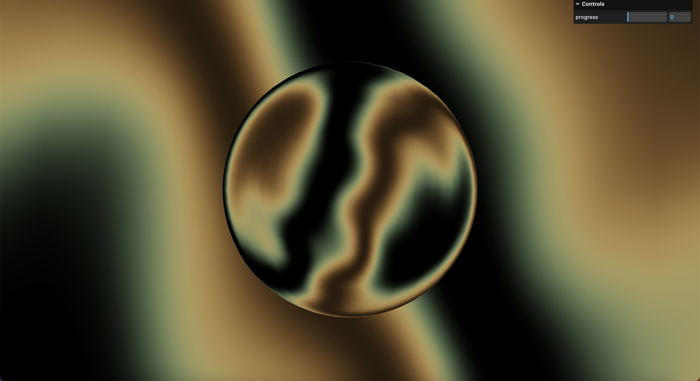

# monopo

* [Demo](https://gotohiroki.github.io/three-monopo/dist/)
* [monopo website](https://monopo.vn/)



## 🎮 ~ Getting Started

```
// install
npm i

// development
npm run dev

// production
npm run build

// build preview
npm run preview
```

## 📝 ~ Reference
* [monopo](https://monopo.vn/)
* [Beautiful noise with three.js from monopo.vn #1](https://www.youtube.com/watch?v=sPBb-0al7Y0)
* [nemutas](https://github.com/nemutas/r3f-monopo)

